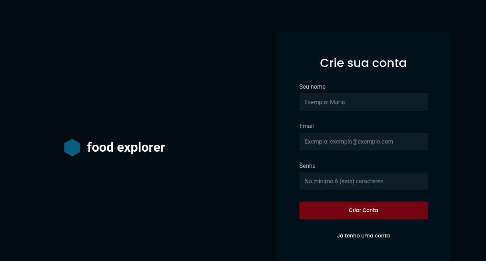
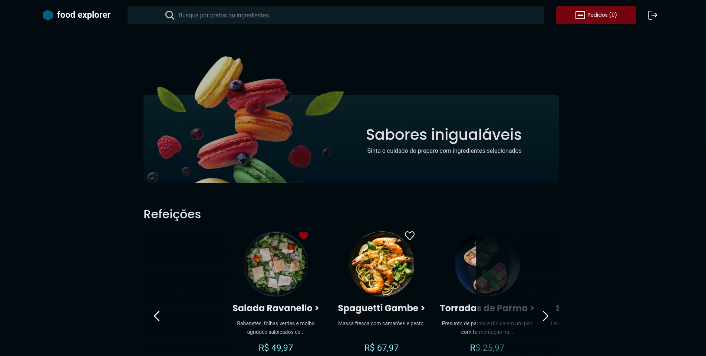

# Food Explorer
### Pick the best language for you: 
[](./README.md)
[](./README.pt-br.md)

A restaurant website fully integrated with the [foodExplorer-backend](https://github.com/pe-Gomes/foodExplorer-backend). The present front-end was created with React and Vite, alongside with Styled Components and some custom components from headlessUI.

The front-end was created to provide integration with the following features:

* **Create** users.
* **Create, update and delete** products.
* **Upload and delete files** for product images.
* **Manage categories for products** (drink, meal and dessert).
* **Set user's favorite products**.
* Use **JWT Token** to authenticate and create user session.
* Only *admin users can manage* products.

Users can view the available products, see descriptions, search for ingredients and product's names, add products to cart and favorite products.

Only the admin user can edit, create and delete products.

## Deployed front-end

The website can be accessed without local running using the following link: 
### [FoodExplorer](https://appfoodexplorer.netlify.app/)

Please, be aware that it's hosted on limited capacities, thus be ready for some loading time.

Here, in order to access admin functionality you must login with the following credentials:

| E-mail            | Password |
| :---------------- | :------- |
| `pedro@email.com` | `123`    |

## Installation

If you prefer an snappier experience, you can run the front-end application locally. For optimal performance, make sure to also run [foodExplorer-backend](https://github.com/pe-Gomes/foodExplorer-backend) locally. 

After that, simply clone the presente repository, install dependencies and run!

```bash
   ## Get into the repo's folder
   cd foodExplorer-frontend

   ## Install node dependencies

   npm install

   ## Run the application with Vite

   npm run dev
``` 
# Website flow

## Login

``` https
  https://app.com/ 

```

<details><summary>View image</summary>
<p>


</p>
</details>

## Register

``` https
  https://app.com/register

```

<details><summary>View image</summary>
<p>



</p>
</details>


## Home

``` https
  https://app.com/ 

```
Normal user:
<details><summary>View image</summary>
<p>



</p>
</details>

Admin user:
<details><summary>View image</summary>
<p>


</p>
</details>


## Product's Details

``` https
  https://app.com/details/${id}

```
Normal user:
<details><summary>View image</summary>
<p>


</p>
</details>

Admin user:
<details><summary>View image</summary>
<p>
  
  
  
</p>
</details>

## New product

``` https
  https://app.com/new

```

<details><summary>View image</summary>
<p>


</p>
</details>

## Edit or delete product 

``` https
  https://app.com/edit/${id} 

```

<details><summary>View image</summary>
<p>


</p>
</details>

## Tech Stack

**Client:** React, Vite, Styled Components, HeadlessUI.

**Server:** Node, Express, Knex, jsonwebtoken, Jest, Multer, dotenv.

This app was used with an API called **foodExplorer-backend**: [Click here to check out the repo](https://github.com/pe-Gomes/foodExplorer-backend).


