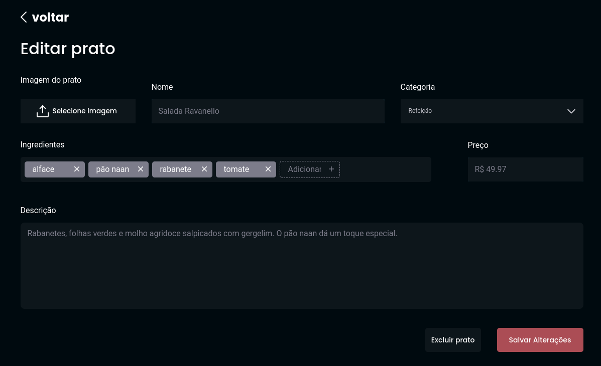

# Food Explorer
#### Escolha o melhor idioma para a sua compreensão: 
[](./README.md)
[](./README.pt-br.md)

Um website responsivo para um restaurante. O FoodExplorer foi completamente integrado com a API [foodExplorer-backend](https://github.com/pe-Gomes/foodExplorer-backend). O front-end foi construído com React e Vite, além do StyledComponents e alguns componentes do headlessUI.

O front-end foi construído para integrar as seguintes características:

* **Criar** usuários.
* **Criar, atualizar e deletar** produtos.
* **Fazer upload and deletar arquivos** relacionados com as images de cada produto.
* **Gerir as categorias de cada produto** (bebidas, refeições e sobremesas).
* **Definir quais são os produtos favoritos dos usuários**.
* Usar **JWT Token** para autenticar o usuário e criar um sessão quando logado.
* Apenas *usuários admin poderão fazer alterações* de produto.

Usuários comuns poderão ver os produtos disponíveis, suas descrições, além de fazer buscas pelos ingredientes e nomes dos produtos. Além disso, poderão adicionar e remover produtos como favoritos.

Somente o usuário admin poderá criar, editar e deletar produtos.

## Front-end em produção

O site poderá ser acessado sem a necessidade de executar localmente por meio do seguinte link: 
### [FoodExplorer](https://appfoodexplorer.netlify.app/)

Tenham em mente que o serviço está hospedado sob recursos limitados, portanto, esteja preparado para esperar o carregamento da página.

Aqui, para que se tenha acesso à funcionalidade de admin, deve-se logar com as seguintes credenciais:

| E-mail            | Password |
| :---------------- | :------- |
| `pedro@email.com` | `123`    |

## Instalação

Se você prefere uma experiência mais rápida, aconselho rodar a aplicação localmente. Para a melhor performance, certifique-se de que também possui o [foodExplorer-backend](https://github.com/pe-Gomes/foodExplorer-backend) rodando localmente. 

Depois disso, simplesmente clone o repositório, instale as dependências e rode a aplicação!

```bash
   ## Get into the repo's folder
   cd foodExplorer-frontend

   ## Install node dependencies

   npm install

   ## Run the application with Vite

   npm run dev
``` 
# Fluxo do website

## Login

``` https
  https://app.com/ 

```

<details><summary>Abrir imagem</summary>
<p>


</p>
</details>

## Cadastre-se

``` https
  https://app.com/register

```

<details><summary>Abrir imagem</summary>
<p>


</p>
</details>


## Home ou Página Inicial

``` https
  https://app.com/ 

```
Usuário comum:
<details><summary>Abrir imagem</summary>
<p>


</p>
</details>

Usuário admin:
<details><summary>Abrir imagem</summary>
<p>


</p>
</details>


## Detalhes do produto

``` https
  https://app.com/details/${id}

```
Usuário comum:
<details><summary>Abrir imagem</summary>
<p>


</p>
</details>

Usuário admin:
<details><summary>Abrir imagem</summary>
<p>
  
  
  
</p>
</details>

## Novo produto

``` https
  https://app.com/new

```

<details><summary>Abrir imagem</summary>
<p>


</p>
</details>

## Edite ou delete o produto 

``` https
  https://app.com/edit/${id} 

```

<details><summary>Abrir imagem</summary>
<p>



</p>
</details>

## Tech Stack

**Client:** React, Vite, Styled Components, HeadlessUI.

**Server:** Node, Express, Knex, jsonwebtoken, Jest, Multer, dotenv.

A presente aplicação foi utilizada em conjunto com a API **foodExplorer-backend**: [Clique aqui para abrir o link do repositório](https://github.com/pe-Gomes/foodExplorer-backend) para mais informações.


